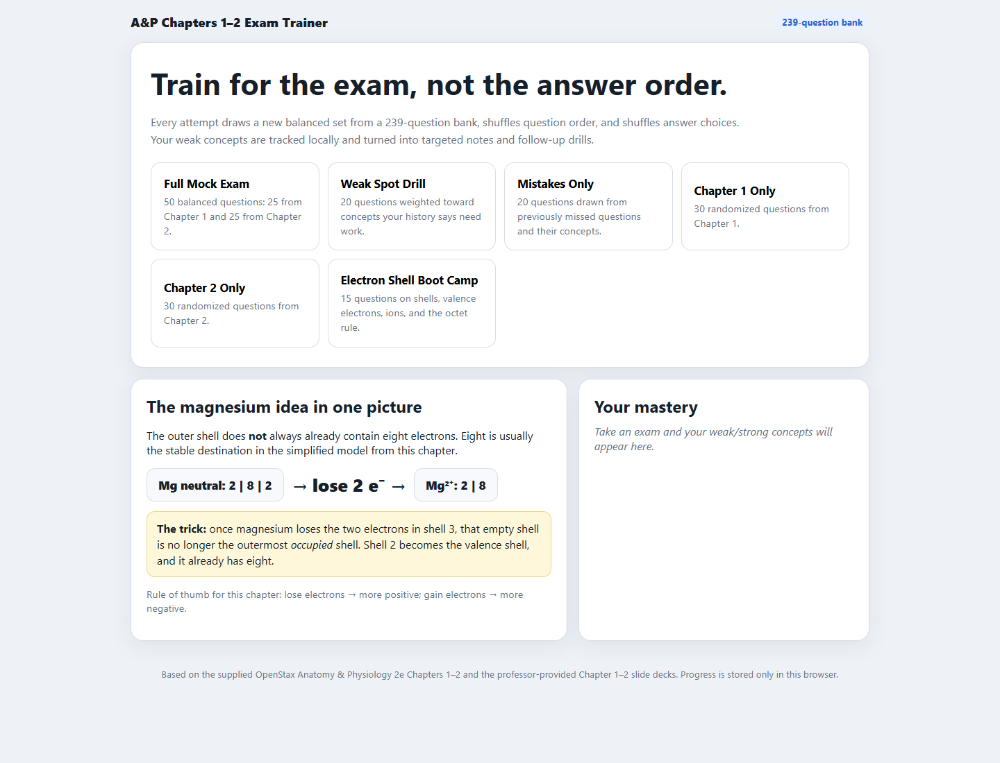

<div align="center">

# 🧠 A&P Chapters 1–2 Exam Trainer

**Understand the concepts. Build confidence. Stop memorizing answer positions.**


[](LICENSE)
[](https://github.com/RorriMaesu/OpenStax-Anatomy-Exam-Chapters1-2/actions/workflows/pages.yml)

### [🚀 Launch Live App](https://rorrimaesu.github.io/OpenStax-Anatomy-Exam-Chapters1-2/)

An independent, browser-based study companion for **OpenStax Anatomy & Physiology 2e, Chapters 1 and 2**.

</div>



Practice anatomy fundamentals and introductory chemistry with randomized exams, clear answer explanations, and study notes selected from the concepts you missed. Everything runs in one self-contained HTML file.

## ✨ Study with purpose

- **239 questions across 20 concepts:** 105 Chapter 1 questions and 134 Chapter 2 questions, including single-answer and select-all-that-apply formats.
- **Three layers of randomization:** question selection, question order, and answer-choice order.
- **Two views of performance:** strict exam scoring and partial concept credit.
- **Useful feedback:** missed and partial answers, correct answers, explanations, and a full review tab.
- **Targeted follow-up:** concept mastery, weak-spot practice, personalized notes, and memory hooks.
- **Pick up where you left off:** saved answers and exam position, with resume and discard controls.
- **Take your notes with you:** download personalized study notes as a plain-text file.

## Choose your session

| Mode | Questions | What it does |
| :--- | :---: | :--- |
| Full Mock Exam | 50 | Balances 25 questions from each chapter. |
| Weak Spot Drill | 20 | Samples across up to eight concepts ranked lowest by historical concept accuracy. |
| Mistakes Only | 20 | Prioritizes previously missed questions and concepts below 85% accuracy; fills remaining places from the wider bank when needed. |
| Chapter 1 Only | 30 | Practices the organization of the body and anatomy foundations. |
| Chapter 2 Only | 30 | Practices chemical foundations of life. |
| Electron Shell Boot Camp | 15 | Draws from 21 questions about shells, valence electrons, ions, and the octet rule. |

## How adaptive studying works

After submission, the app accumulates concept credit and question counts in your browser. Weak Spot Drill ranks concepts by this historical accuracy and samples across the eight lowest-ranked concepts. Unseen concepts receive a ranking value of 75%; this is a sampling default, not an earned score.

Mistakes Only combines missed question IDs with questions from concepts below 85% historical accuracy. A fully correct later answer removes that question from the missed set. With no eligible history, the mode falls back to a weak-spot drill; a small eligible pool is supplemented with other questions to reach 20.

The home screen shows up to ten tracked concepts, weakest first. Personalized Notes selects prepared explanations and mnemonics for concepts missed or partly correct in the latest attempt. “Practice These Weak Spots” starts a drill based on accumulated history, including that attempt.

## Randomized exams, stable answer keys

The sampler distributes questions across available concept groups, shuffling within and between groups. Full Mock Exam applies that process separately to each chapter. The selected questions are then shuffled, and every question’s choices are shuffled with its correct-answer indices remapped to match.

Questions do not repeat within an attempt. They can reappear across attempts, and a new attempt is not guaranteed to contain entirely new questions. The goal is to recognize the underlying idea wherever its answer appears.

## Scoring that distinguishes recall from understanding

**Strict score:** a question earns one point only when the selected set exactly matches the correct set. Unanswered questions earn zero.

**Concept accuracy:** single-answer questions still earn either zero or one. Select-all questions receive `correct selections ÷ unique choices in the union of selected and correct answers`. Missing a correct choice or selecting an incorrect one reduces credit. The displayed percentage averages credit across questions; it is a study signal, not an official course grade.

## ⚛️ Electron shells, made concrete

The home screen illustrates neutral magnesium as **2 | 8 | 2**, then shows **Mg²⁺ as 2 | 8** after it loses two electrons. The accompanying explanation distinguishes the outermost *occupied* shell from an empty shell and treats eight electrons as a common stable destination in the chapter’s simplified model. Boot Camp and the related notes reinforce valence, ions, and electron loss/gain.

## Your progress stays in this browser

The app uses `localStorage` for concept statistics, missed question IDs, and an in-progress exam. It has no backend, account system, or cross-device synchronization. The app does not send your answers to a server.

Progress is specific to this browser profile and site origin. Clearing site data removes it; private browsing may discard it when closed. Progress from a locally opened file does not automatically transfer to the live site. Allow browser storage for saving and resuming. Completed result details are held only for the current page session, so download notes before closing or reloading.

## How to use

1. [Open the live trainer](https://rorrimaesu.github.io/OpenStax-Anatomy-Exam-Chapters1-2/) and choose a mode.
2. Select an answer—or all applicable answers—and navigate with Previous, Next, or the numbered grid.
3. On the last question, select **Submit Exam**. The app asks for confirmation if questions remain unanswered.
4. Compare strict score with concept accuracy. Read **Missed & Partial**, **Personalized Notes**, and **Review All**.
5. Download notes and practice weak spots. Return home to see mastery or start another mode.

## Run locally

Download or clone this repository, then open `index.html` in a modern browser. No installation or build is required. If your browser restricts storage for local files, serve the folder with a static server. With Python installed:

```sh
python -m http.server 8000
```

Open [localhost:8000](http://localhost:8000) and keep using that same address to retain the same storage origin.

## Built with

Semantic HTML, responsive CSS, vanilla JavaScript, browser `localStorage`, and the Blob/download APIs. GitHub Pages hosts the static site; GitHub Actions publishes the repository root on pushes to `main` or a manual workflow run. No framework, package manager, external app library, or backend is required.

## Repository structure

```text
.
├── index.html                 # Complete app, question bank, styles, and logic
├── README.md                  # Project guide
├── docs/images/exam-trainer-home.png # Screenshot of the live home screen
├── LICENSE                    # MIT license for original software/code
├── .gitignore                 # Local/editor/generated file exclusions
└── .github/workflows/pages.yml # Official GitHub Pages deployment workflow
```

## Source material

Concept coverage follows [OpenStax Anatomy & Physiology 2e](https://openstax.org/details/books/anatomy-and-physiology-2e), Chapters 1–2. The supplied app also identifies professor-provided chapter slide decks as study references; those decks are not distributed here. Consult your textbook and instructor’s materials for authoritative course coverage. This README contains no reproduced textbook passages.

## Contributing

Issues and focused pull requests are welcome. For a suspected question error, include the question text, concept, expected correction, and a supporting source. For a software bug, include the mode, browser, and steps to reproduce it. Preserve correct-answer mapping when changing options, and check all six modes, scoring, resume behavior, and note downloads before proposing changes. Do not submit private student data or materials you lack permission to share.

## License & disclaimer

The [MIT License](LICENSE) applies only to original software/code contributed to this project. It does not relicense OpenStax textbook content, instructor materials, trademarks, or other third-party materials; those retain their respective rights and license terms.

This is an independent study aid, **not affiliated with or endorsed by OpenStax, Umpqua Community College, or the course instructor**. It is not an official exam, grading tool, or substitute for assigned materials. Questions, simplified models, and explanations may contain errors; verify uncertain answers against course sources.
